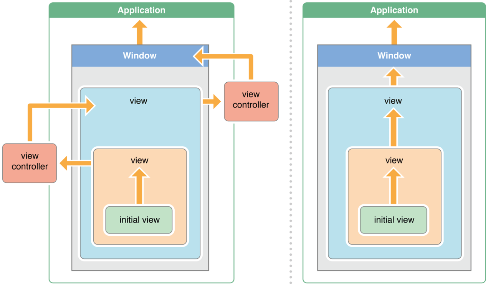

# Questions and answers 

### Form the [References](#references) listed at bottom of file.

---
  __Q1:__
  __On a UITableViewCell constructor:__
  
  __Objective-C__
  
  ```
  - (id)initWithStyle:(UITableViewCellStyle)style reuseIdentifier:(NSString *)reuseIdentifier
  ```
  
  __Swift__
  
  ```
  init(style: UITableViewCellStyle, reuseIdentifier: String?)
  ```
  
  __What is the `reuseIdentifier` used for?__
  
  __A1:__
  The `reuseIdentifier` is used to indicate that a cell can be re-used in a `UITableView`. For example when the cell looks the same, but has different content. The `UITableView` will maintain an internal cache of `UITableViewCell`’s with the `reuseIdentifier` and allow them to be re-used when `dequeueReusableCellWithIdentifier:` is called. By re-using table cell’s the scroll performance of the tableview is better because new views do not need to be created.
  
---
__Q2:__
__Explain the difference between atomic and nonatomic synthesized properties?__

__A2:__
Atomic and non-atomic refers to whether the setters/getters for a property will atomically read and write values to the property. When the atomic keyword is used on a property, any access to it will be “synchronized”. Therefore a call to the getter will be guaranteed to return a valid value, however this does come with a small performance penalty. Hence in some situations nonatomic is used to provide faster access to a property, but there is a chance of a race condition causing the property to be nil under rare circumstances (when a value is being set from another thread and the old value was released from memory but the new value hasn’t yet been fully assigned to the location in memory for the property).

---
__Q3:__
__Explain the difference between copy and retain?__

__A3:__
Retaining an object means the retain count increases by one. This means the instance of the object will be kept in memory until it’s retain count drops to zero. The property will store a reference to this instance and will share the same instance with anyone else who retained it too. Copy means the object will be cloned with duplicate values. It is not shared with any one else.

---
__Q4:__
__What is method swizzling in Objective C and why would you use it?__

__A4:__
Method swizzling allows the implementation of an existing selector to be switched at runtime for a different implementation in a classes dispatch table. Swizzling allows you to write code that can be executed before and/or after the original method. For example perhaps to track the time method execution took, or to insert log statements

```
#import "UIViewController+Log.h"
@implementation UIViewController (Log)
    + (void)load {
        static dispatch_once_t once_token;
        dispatch_once(&once_token,  ^{
            SEL viewWillAppearSelector = @selector(viewDidAppear:);
            SEL viewWillAppearLoggerSelector = @selector(log_viewDidAppear:);
            Method originalMethod = class_getInstanceMethod(self, viewWillAppearSelector);
            Method extendedMethod = class_getInstanceMethod(self, viewWillAppearLoggerSelector);
            method_exchangeImplementations(originalMethod, extendedMethod);
        });
    }
    - (void) log_viewDidAppear:(BOOL)animated {
        [self log_viewDidAppear:animated];
        NSLog(@"viewDidAppear executed for %@", [self class]);
    }
@end

```

---
__Q5:__
__What’s the difference between not-running, inactive, active, background and suspended execution states?__

__OR__

__What are the different app states?__

__A5:__

* __Not running:__ The app has not been launched or was running but was terminated by the system.

* __Inactive:__ The app is running in the foreground but is currently not receiving events. (It may be executing other code though.) An app usually stays in this state only briefly as it transitions to a different state.

* __Active:__ The app is running in the foreground and is receiving events. This is the normal mode for foreground apps.

* __Background:__ The app is in the background and executing code. Most apps enter this state briefly on their way to being suspended. However, an app that requests extra execution time may remain in this state for a period of time. In addition, an app being launched directly into the background enters this state instead of the inactive state.

* __Suspended:__ The app is in the background but is not executing code. The system moves apps to this state automatically and does not notify them before doing so. While suspended, an app remains in memory but does not execute any code. When a low-memory condition occurs, the system may purge suspended apps without notice to make more space for the foreground app.

---
__Q6:__
__What is a category and when is it used?__

__A6:__
A category is a way of adding additional methods to a class without extending it. It is often used to add a collection of related methods. A common use case is to add additional methods to built in classes in the Cocoa frameworks. For example adding async download methods to the `UIImage` class.

---
__Q7:__
__Can you spot the bug in the following code and suggest how to fix it?__

```
@interface MyCustomController : UIViewController  

@property (strong, nonatomic) UILabel *alert;  

@end  

@implementation MyCustomController  

- (void)viewDidLoad {
     CGRect frame = CGRectMake(100, 100, 100, 50);
     self.alert = [[UILabel alloc] initWithFrame:frame];
     self.alert.text = @"Please wait...";
     [self.view addSubview:self.alert];
      dispatch_async(
        dispatch_get_global_queue(DISPATCH_QUEUE_PRIORITY_DEFAULT, 0),
        ^{
           sleep(10);
           self.alert.text = @"Waiting over";
        }
    ); 
}  

@end  
```

__A7:__
All UI updates must be done on the ___main thread___. In the code above the update to the alert text may or may not happen on the main thread, since the global dispatch queue makes no guarantees . Therefore the code should be modified to always run the UI update on the main thread

```
dispatch_async(		
    dispatch_get_global_queue(DISPATCH_QUEUE_PRIORITY_DEFAULT, 0),
    ^{
      sleep(10);
      dispatch_async(dispatch_get_main_queue(), ^{
         self.alert.text = @"Waiting over";
      });
}); 
```

---
__Q8:__
__What is the difference between `viewDidLoad` and `viewDidAppear`? Which should you use to load data from a remote server to display in the view?__

__A8:__
`viewDidLoad` is called when the view is loaded, whether from a Xib file, storyboard or programmatically created in `loadView`. `viewDidAppear` is called every time the view is presented on the device. Which to use depends on the use case for your data. If the data is fairly static and not likely to change then it can be loaded in `viewDidLoad` and cached. However if the data changes regularly then using `viewDidAppear` to load it is better. In both situations, the data should be loaded asynchronously on a background thread to avoid blocking the UI.

---
__Q9:__
__What considerations do you need when writing a `UITableViewController` which shows images downloaded from a remote server?__

__A9:__
This is a very common task in iOS and a good answer here can cover a whole host of knowledge. The important piece of information in the question is that the images are hosted remotely and they may take time to download, therefore when it asks for “considerations”, you should be talking about:

* Only download the image when the cell is scrolled into view, i.e. when `cellForRowAtIndexPath` is called.
* Downloading the image asynchronously on a background thread so as not to block the UI so the user can keep scrolling.
* When the image has downloaded for a cell we need to check if that cell is still in the view or whether it has been re-used by another piece of data. If it’s been re-used then we should discard the image, otherwise we need to switch back to the main thread to change the image on the cell.

Other good answers will go on to talk about offline caching of the images, using placeholder images while the images are being downloaded.

---
__Q10:__
__What is a protocol, how do you define your own and when is it used?__

__A10:__
A protocol is similar to an interface from Java. It defines a list of required and optional methods that a class must/can implement if it adopts the protocol. Any class can implement a protocol and other classes can then send messages to that class based on the protocol methods without it knowing the type of the class.

```
@protocol MyCustomDataSource
- (NSUInteger)numberOfRecords;
- (NSDictionary *)recordAtIndex:(NSUInteger)index;
@optional
- (NSString *)titleForRecordAtIndex:(NSUInteger)index;
@end
```

A common use case is providing a DataSource for `UITableView` or `UICollectionView`.

---
__Q11:__
__What is KVC and KVO? Give an example of using KVC to set a value.__

__A11:__
*KVC* stands for *Key-Value Coding*. It's a mechanism by which an object's properties can be accessed using string's at runtime rather than having to statically know the property names at development time. *KVO* stands for *Key-Value Observing* and allows a controller or class to observe changes to a property value.

Let's say there is a property name on a class:

```
@property (nonatomic, copy) NSString *name;
```

We can access it using KVC:

```
NSString *n = [object valueForKey:@"name"]
```

And we can modify it's value by sending it the message:

```
[object setValue:@"Mary" forKey:@"name"]
```

---
__Q12:__
__What are blocks and how are they used?__

__A12:__
Blocks are a way of defining a single task or unit of behavior without having to write an entire Objective-C class. Under the covers Blocks are still Objective C objects. They are a language level feature that allow programming techniques like lambdas and closures to be supported in Objective-C. Creating a block is done using the `^ { }` syntax:

```
 myBlock = ^{
    NSLog(@"This is a block");
 }
```

It can be invoked like so: ``` myBlock(); ```

It is essentially a function pointer which also has a signature that can be used to enforce type safety at compile and runtime. For example you can pass a block with a specific signature to a method like so:

```
- (void)callMyBlock:(void (^)(void))callbackBlock;
```

If you wanted the block to be given some data you can change the signature to include them:

```
- (void)callMyBlock:(void (^)(double, double))block {
    ...
    block(3.0, 2.0);
}
```

---
__Q13:__
__What mechanisms does iOS provide to support multi-threading?__

__A13:__
When an event happens in a view, for example a touch event, the view will fire the event to a chain of UIResponder objects associated with the UIView. The first UIResponder is the UIView itself, if it does not handle the event then it continues up the chain to until UIResponder handles the event. The chain will include UIViewControllers, parent UIViews and their associated UIViewControllers, if none of those handle the event then the UIWindow is asked if it can handle it and finally if that doesn't handle the event then the UIApplicationDelegate is asked.

* `NSThread` creates a new low-level thread which can be started by calling the `start` method.

```
NSThread* myThread = [[NSThread alloc] initWithTarget:self
                                        selector:@selector(myThreadMainMethod:)
                                        object:nil];
[myThread start]; 
```

* `NSOperationQueue` allows a pool of threads to be created and used to execute `NSOperations` in parallel. `NSOperations` can also be run on the main thread by asking `NSOperationQueue` for the `mainQueue`.

```
NSOperationQueue* myQueue = [[NSOperationQueue alloc] init];
[myQueue addOperation:anOperation]; 
[myQueue addOperationWithBlock:^{
   /* Do something. */
}];
```

* *GCD* or *Grand Central Dispatch* is a modern feature of Objective-C that provides a rich set of methods and API's to use in order to support common multi-threading tasks. GCD provides a way to queue tasks for dispatch on either the main thread, a concurrent queue (tasks are run in parallel) or a serial queue (tasks are run in FIFO order).

```
dispatch_queue_t myQueue = dispatch_get_global_queue(DISPATCH_QUEUE_PRIORITY_DEFAULT, 0);
dispatch_async(myQueue, ^{
    printf("Do some work here.\n");
});
```

---
__Q14:__
__What is the Responder Chain?__

__A14:__
When an event happens in a view, for example a touch event, the view will fire the event to a chain of `UIResponder` objects associated with the `UIView`. The first `UIResponder` is the `UIView` itself, if it does not handle the event then it continues up the chain to until `UIResponder` handles the event. The chain will include `UIViewController`'s, parent `UIView`'s and their associated `UIViewController`'s, if none of those handle the event then the `UIWindow` is asked if it can handle it and finally if that doesn't handle the event then the `UIApplicationDelegate` is asked.

If you get the opportunity to draw this one out, it's worth doing to impress the interviewer:



---
__Q15:__
__What's the difference between using a *delegate* and *notification*?__

__A15:__
Both are used for sending values and messages to interested parties. A delegate is for one-to-one communication and is a pattern promoted by Apple. In delegation the class raising events will have a property for the delegate and will typically expect it to implement some `protocol`. The delegating class can then call the _delegate_s protocol methods.

Notification allows a class to broadcast events across the entire application to any interested parties. The broadcasting class doesn't need to know anything about the listeners for this event, therefore notification is very useful in helping to decouple components in an application.

```
[NSNotificationCenter defaultCenter] 
        postNotificationName:@"TestNotification" 
        object:self];
```

---
__Q16:__
__What's your preference when writing UI's? Xib files, Storyboards or programmatic `UIView`?__

__A16:__
There's no right or wrong answer to this, but it's great way of seeing if you understand the benefits and challenges with each approach. Here's the common answers I hear:

* Storyboard's and Xib's are great for quickly producing UI's that match a design spec. They are also really easy for product managers to visually see how far along a screen is.

* Storyboard's are also great at representing a flow through an application and allowing a high-level visualization of an entire application.

* Storyboard's drawbacks are that in a team environment they are difficult to work on collaboratively because they're a single file and merge's become difficult to manage.

* Storyboards and Xib files can also suffer from duplication and become difficult to update. For example if all button's need to look identical and suddenly need a color change, then it can be a long/difficult process to do this across storyboards and xibs.

* Programmatically constructing `UIView`'s can be verbose and tedious, but it can allow for greater control and also easier separation and sharing of code. They can also be more easily unit tested.

Most developers will propose a combination of all 3 where it makes sense to share code, then re-usable `UIView`'s or `Xib` files.


---
# References

1. [Codemoderator](https://www.codementor.io/ios/tutorial/ios-interview-tips-questions-answers-objective-c "Codemoderator")

2. [Toptal](https://www.toptal.com/ios/interview-questions "Toptal")

3. [Ravi Shankar](http://rshankar.com/ "Ravi Shankar")
